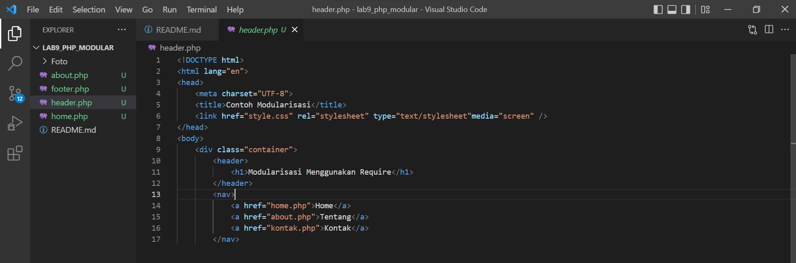
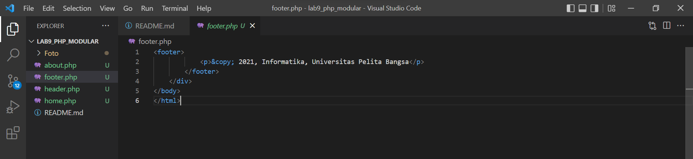
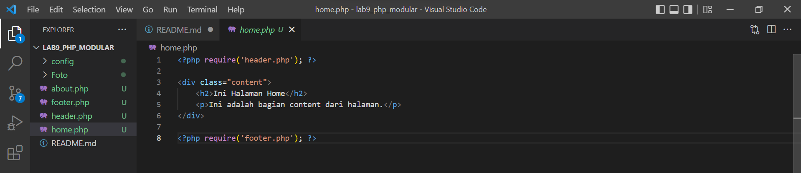
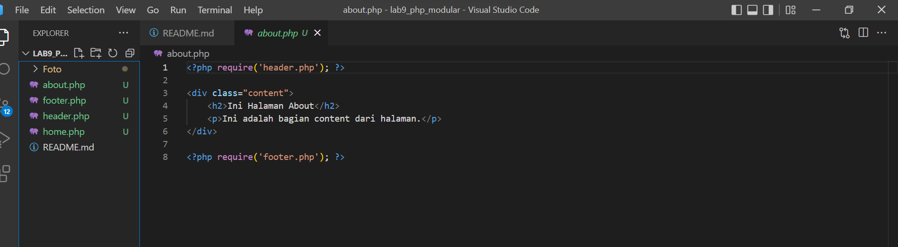
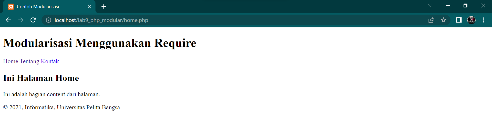
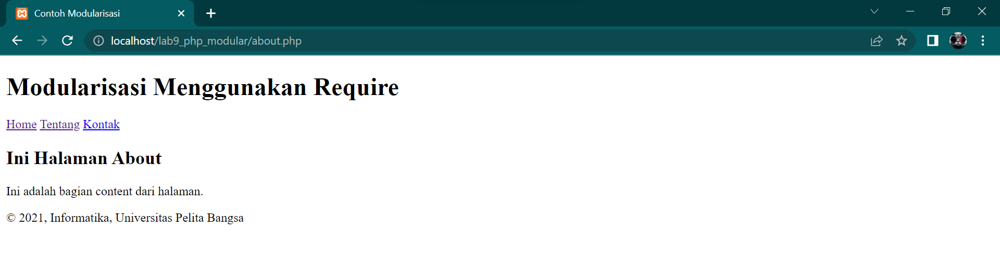

| Nama      | SHOBAHUS SOLICHIN |
| ----------- | ----------- |
| NIM     | 312010076       |
| Kelas   | TI.20.A.1        |

## Langkah langkah praktikum 9

### 1. Buat file baru dengan nama header.php


### 2. Buat file baru dengan nama footer.php


### 3. Buat file baru dengan nama home.php


### 4. Buat file baru dengan nama about.php


### 5. Output
- Halaman Home

- Halaman About


## Pertanyaan dan Tugas
Implementasikan konsep modularisasi pada kode program praktikum 8 tentang database, sehingga setiap halamannya memiliki template tampilan yang sama.

## Berikut struktur yang saya buat
Lab9_php_database
```
├── config
│   ├── hapus.php
│   ├── koneksi.php
│   ├── tambah.php
│   └── ubah.php
├── layouts
│   ├── footer.php
│   ├── head-static.php
│   ├── header.php
│   ├── main.php
│   ├── tambah.php
│   └── ubah.php
├── static
│   ├── css
│   │   └── style.css
│   └── img
├── index.php
├── tambah.php
└── ubah.php
```

## Config 
Dalam folder tersebut menyimpan file khusus php yang nanti akan dieksekusi

- koneksi.php


- tambah.php


- ubah.php


- hapus.php


## Layouts
Untuk menyimpan tampilan utama pada website, dan dibagi pada beberapa file

- head-static.php


- header.php


- main.php


- footer.php


## Static
Untuk menyimpan file yang diperlukan seperti css, js, gambar

- style.css


## index.php, tambah.php, ubah.php
File utama dan berfungsi sebagai wadah untuk memanggil sub-file di beberapa direktori

- index.php


- tambah.php


- ubah.php


# Output


- Tambah barang


- Ubah barang


