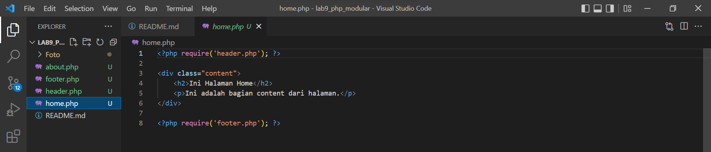

| Nama      | SHOBAHUS SOLICHIN |
| ----------- | ----------- |
| NIM     | 312010076       |
| Kelas   | TI.20.A.1        |

## Langkah langkah praktikum 9

### 1. Buat file baru dengan nama header.php


### 2. Buat file baru dengan nama footer.php


### 3. Buat file baru dengan nama home.php


### 4. Buat file baru dengan nama about.php


### 5. Output
- Halaman Home

- Halaman About


## Pertanyaan dan Tugas
Implementasikan konsep modularisasi pada kode program praktikum 8 tentang database, sehingga setiap halamannya memiliki template tampilan yang sama.

## Berikut struktur yang saya buat
Lab9_php_database
```
├── config
│   ├── hapus.php
│   ├── koneksi.php
│   ├── tambah.php
│   └── ubah.php
├── layouts
│   ├── footer.php
│   ├── head-static.php
│   ├── header.php
│   ├── main.php
│   ├── tambah.php
│   └── ubah.php
├── static
│   ├── css
│   │   └── style.css
│   └── img
├── index.php
├── tambah.php
└── ubah.php
```

## Config 
Dalam folder tersebut menyimpan file khusus php yang nanti akan dieksekusi

- koneksi.php
```php
<?php

$host = "localhost";
$user = "root";
$pass = "";
$db = "latihan1";
$conn = mysqli_connect($host, $user, $pass, $db);
if ($conn == false)
{
echo "Koneksi ke server gagal.";
die();
} #else echo " ";

$sql = 'SELECT * FROM data_barang';
$result = mysqli_query($conn, $sql);

?>
```

- tambah.php
```php
<?php
error_reporting(E_ALL);
include_once 'koneksi.php';
if (isset($_POST['submit']))
{
    $nama = $_POST['nama'];
    $kategori = $_POST['kategori'];
    $harga_jual = $_POST['harga_jual'];
    $harga_beli = $_POST['harga_beli'];
    $stok = $_POST['stok'];
    $file_gambar = $_FILES['file_gambar'];
    $gambar = null;
    if ($file_gambar['error'] == 0){
        $filename = str_replace(' ', '_', $file_gambar['name']);
        $destination = dirname(__FILE__) . '/gambar/' . $filename;
        if (move_uploaded_file($file_gambar['tmp_name'], $destination)){
            $gambar = 'gambar/' . $filename;;
        }
    }
    $sql = 'INSERT INTO data_barang (nama, kategori,harga_jual, harga_beli, stok, gambar) ';
    $sql .= "VALUE ('{$nama}', '{$kategori}', '{$harga_jual}', '{$harga_beli}', '{$stok}', '{$gambar}')";
    $result = mysqli_query($conn, $sql);
    header('location: index.php');
}
?>
```

- ubah.php
```php
<?php
error_reporting(E_ALL);
include_once 'koneksi.php';
if (isset($_POST['submit']))
{
    $id = $_POST['id'];
    $nama = $_POST['nama'];
    $kategori = $_POST['kategori'];
    $harga_jual = $_POST['harga_jual'];
    $harga_beli = $_POST['harga_beli'];
    $stok = $_POST['stok'];
    $file_gambar = $_FILES['file_gambar'];
    $gambar = null;
    if ($file_gambar['error'] == 0)
    {
        $filename = str_replace(' ', '_', $file_gambar['name']);
        $destination = dirname(__FILE__) . '/gambar/' . $filename;
        if (move_uploaded_file($file_gambar['tmp_name'], $destination))
        {
            $gambar = 'gambar/' . $filename;;
        }
    }
    $sql = 'UPDATE data_barang SET ';
    $sql .= "nama = '{$nama}', kategori = '{$kategori}', ";
    $sql .= "harga_jual = '{$harga_jual}', harga_beli = '{$harga_beli}', stok = '{$stok}' ";
    if (!empty($gambar)) $sql .= ", gambar = '{$gambar}' ";
    $sql .= "WHERE id_barang = '{$id}'";
    $result = mysqli_query($conn, $sql);
    header('location: index.php');
}
$id = $_GET['id'];
$sql = "SELECT * FROM data_barang WHERE id_barang = '{$id}'";
$result = mysqli_query($conn, $sql);
if (!$result) die('Error: Data tidak tersedia');
$data = mysqli_fetch_array($result);
function is_select($var, $val)
{
    if ($var == $val) return 'selected="selected"';
    return false;
}
?>
```

- hapus.php
```php
<?php
include_once 'koneksi.php';
$id = $_GET['id'];
$sql = "DELETE FROM data_barang WHERE id_barang = '{$id}'";
$result = mysqli_query($conn, $sql);
header('location: ../index.php');
?>
```
## Layouts
Untuk menyimpan tampilan utama pada website, dan dibagi pada beberapa file

- head-static.php
```php
<meta charset="UTF-8">
<link href="static/css/style.css" rel="stylesheet" type="text/css" />
<link rel="stylesheet" href="https://cdn.jsdelivr.net/npm/bootstrap@4.6.1/dist/css/bootstrap.min.css" integrity="sha384-zCbKRCUGaJDkqS1kPbPd7TveP5iyJE0EjAuZQTgFLD2ylzuqKfdKlfG/eSrtxUkn" crossorigin="anonymous">
```

- header.php
```php
<!DOCTYPE html>
<html lang="en">
  <head>
    <?php require('head-static.php'); ?>
    <title>Data Barang</title>
  </head>
  <body>
    <div class="container ">
      <h1>Data Barang</h1>
      <a href="tambah.php">Tambah Barang</a>
```

- main.php
```php
      <div class="main mt-4">
        <table>
          <tr>
            <th>Gambar</th>
            <th>Nama Barang</th>
            <th>Katagori</th>
            <th>Harga Jual</th>
            <th>Harga Beli</th>
            <th>Stok</th>
            <th>Aksi</th>
          </tr> 
          <?php if($result): ?> <?php while($row = mysqli_fetch_array($result)): ?> 
          <tr>
            <td>
              " alt="<?= $row['nama'];?>">
            </td>
            <td> <?= $row['nama'];?> </td>
            <td> <?= $row['kategori'];?> </td>
            <td> <?= $row['harga_beli'];?> </td>
            <td> <?= $row['harga_jual'];?> </td>
            <td> <?= $row['stok'];?> </td>
            <td> <a class="badge badge-pill badge-primary" href="ubah.php?id=<?php echo $row['id_barang']; ?>">Ubah</a>
            	 / <a class="badge badge-pill badge-danger" href="config/hapus.php?id=<?php echo $row['id_barang']; ?>">Hapus</a>  
            </td> 
            
          </tr> <?php endwhile; else: ?> <tr>
            <td colspan="7">Belum ada data</td>
          </tr> <?php endif; ?>
        </table>
      </div>
      ```
- footer.php
```php
	
		<footer class="mt-4 pt-4" >
			<p>&copy; 2022 | Shobahus Solichin</p>
    	</footer>
    </div>
  </body>
</html>
```

## Static
Untuk menyimpan file yang diperlukan seperti css, js, gambar

- style.css
```php
.container{
	margin-top: 3%;
	font-size: 1.1em;
}
table, th, td{
	border: 1px solid black;
	padding: 10px;
	border-collapse: collapse;
}
tr:nth-child(even) {background-color: #f2f2f2;}
label {
  	display: inline-block;
  	width: 120px;
  	padding-right: 20px;
  	padding-bottom: 20px;
}
input,
textarea {
  	font: 1em sans-serif;
  	box-sizing: border-box;
}
input[type=text] {
  	padding: 4px 0;
  	width: 250px;
}
input[type=file] {
  padding: 4px 0;
  width: 250px;
}
input[type=submit] {
  	position: relative;
	left: 144px;
  	padding: 8px 14px;
  	border-radius: 4px;
  	background-color: #0069FF;
  	border: none;
  	color: white;
  	text-decoration: none;
  	cursor: pointer;
}
select {
  	padding: 8px 50px;
  	border: none;
  	border-radius: 4px;
  	background-color: #f1f1f1;
}
```

## index.php, tambah.php, ubah.php
File utama dan berfungsi sebagai wadah untuk memanggil sub-file di beberapa direktori

- index.php
```php
<?php require('config/koneksi.php'); ?>
<?php require('layouts/header.php'); ?>
<?php require('layouts/main.php'); ?>
<?php require('layouts/footer.php'); ?>
```
- tambah.php
```php
<?php require('config/tambah.php'); ?>
<?php require('layouts/tambah.php'); ?>
```

- ubah.php
```php
<?php require('config/ubah.php'); ?>
<?php require('layouts/ubah.php'); ?>
```

# Output


- Tambah barang


- Ubah barang


